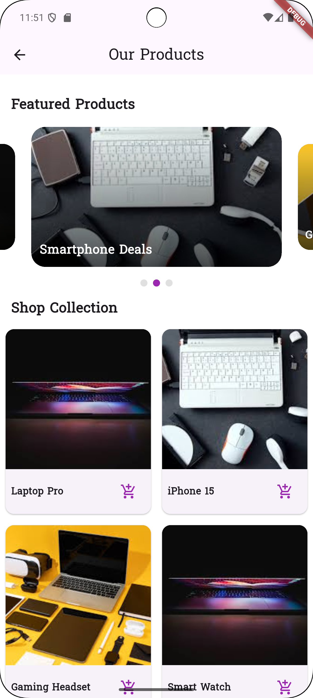

# Roma Shop - Flutter E-Commerce App

A modern Flutter-based e-commerce application featuring user authentication, product browsing, and a clean, responsive UI.

## 📱 Project Overview

Roma Shop is a mobile e-commerce application built with Flutter that provides users with:
- User authentication (sign up/sign in)
- Product browsing with featured items
- Hot offers and product collections
- Clean, responsive user interface

## ✨ Features

### Authentication
- **User Registration**: Create new accounts with email validation
- **User Login**: Secure authentication with Firebase
- **Form Validation**: Comprehensive input validation with user-friendly error messages
- **Password Security**: Minimum 6-character requirement with confirmation check

### Product Display
- **Featured Products Carousel**: Auto-playing image slider with featured items
- **Product Grid**: Responsive grid layout for product collections
- **Hot Offers Section**: Special deals with detailed descriptions
- **Visual Indicators**: Dot indicators for carousel navigation

### User Experience
- **Responsive Design**: Adapts to different screen sizes
- **Loading States**: Visual feedback during authentication processes
- **Error Handling**: User-friendly error messages
- **Smooth Navigation**: Fade transitions between screens

## 🛠️ Tech Stack

- **Framework**: Flutter
- **State Management**: BLoC (Cubit)
- **Authentication**: Firebase Auth
- **UI Components**: Custom widgets with Material Design
- **Image Handling**: Local assets and network images
- **Carousel**: carousel_slider package

## 📋 Setup Instructions

### Prerequisites

- Flutter SDK (latest version)
- Dart SDK
- Firebase project setup
- Android Studio/VSCode with Flutter extension

### Installation Steps

1. **Clone the Repository**
   ```bash
   git clone <[your-repository-url](https://github.com/ibraam123/flutter_shooping_app/tree/master)>
   cd flutter_shooping_app
   ```

2. **Install Dependencies**
   ```bash
   flutter pub get
   ```

3. **Firebase Setup**
   - Create a new Firebase project
   - Enable Email/Password authentication
   - Add Android/iOS app to Firebase project
   - Download and add `google-services.json` (Android) or `GoogleService-Info.plist` (iOS)
   - Enable Firebase Auth in the console

4. **Run the Application**
   ```bash
   flutter run
   ```

### Configuration

1. **Update Firebase Configuration**
   - Ensure Firebase is properly initialized in `main.dart`
   - Verify Firebase dependencies in `pubspec.yaml`

2. **Add Assets**
   - Place product images in `assets/images/` directory
   - Update image paths in the code as needed

## 🗂️ Project Structure

```
lib/
├── cubits/
│   └── auth_cubit.dart          # Authentication state management
├── views/
│   ├── start_view.dart          # Welcome screen
│   ├── sign_in_view.dart        # Login screen
│   ├── sign_up_view.dart        # Registration screen
│   └── home_view.dart           # Main product screen
├── widgets/
│   ├── custom_text_form_field.dart # Custom input field
│   ├── featured_product_card.dart  # Featured product widget
│   ├── hot_offer_item.dart        # Hot offer widget
│   ├── product_card.dart          # Product grid item
│   └── section_title.dart         # Section header
├── routes.dart                   # Navigation routes
└── main.dart                    # Application entry point
```

## 📸 Screenshots

| Welcome Screen | Sign In Screen |
|----------------|----------------|
|  |  |

| Sign Up Screen | Home Screen |
|----------------|-------------|
|  |  |

## 🚀 Usage

1. **First Launch**: Users land on the welcome screen with sign-up/sign-in options
2. **Registration**: New users can create an account with email and password
3. **Login**: Existing users can sign in with their credentials
4. **Browse Products**: Authenticated users can view featured products, collections, and hot offers

## 🔧 Customization

### Adding New Products
Update the product arrays in `home_view.dart`:
```dart
final List<Map<String, String>> _featuredProducts = [
  {"title": "New Product", "image": "assets/images/new_product.jpg"},
];
```

### Modifying UI Themes
Edit the theme in `main.dart`:
```dart
theme: ThemeData(
  fontFamily: "Suwannaphum",
  scaffoldBackgroundColor: Colors.white,
  // Add more theme customization
),
```

## 📝 Repository & Submission Guidelines

### GitHub Repository Setup
- Repository name: `flutter-shopping-app`
- Public visibility
- README.md file with project documentation
- Organized folder structure
- Clear commit messages

### Submission Requirements
- ✅ Public GitHub repository with real name as username
- ✅ Comprehensive README.md with:
  - Project overview
  - Features list
  - Setup instructions
  - Usage guidelines
- ✅ Screenshots of all application screens
- ✅ Clean, well-commented code
- ✅ Proper error handling
- ✅ Responsive UI design

## 🐛 Troubleshooting

### Common Issues

1. **Firebase Connection Issues**
   - Verify Firebase configuration files
   - Check internet connection
   - Validate Firebase rules

2. **Image Loading Problems**
   - Check asset paths in pubspec.yaml
   - Verify image file existence

3. **Authentication Errors**
   - Ensure Firebase Auth is enabled
   - Check email/password validation rules

### Getting Help

1. Check Flutter documentation
2. Review Firebase setup guides
3. Examine error messages in console
4. Verify all dependencies are up to date

## 📄 License

This project is for educational purposes as part of the Flutter development course.

## 👥 Contributing

1. Fork the repository
2. Create a feature branch
3. Make changes with proper testing
4. Submit a pull request with description

---

**Note**: This application is developed for educational purposes and demonstrates Flutter development best practices with Firebase integration.
